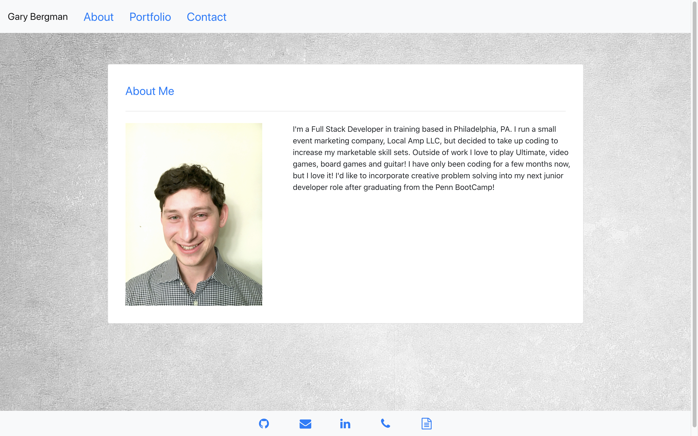
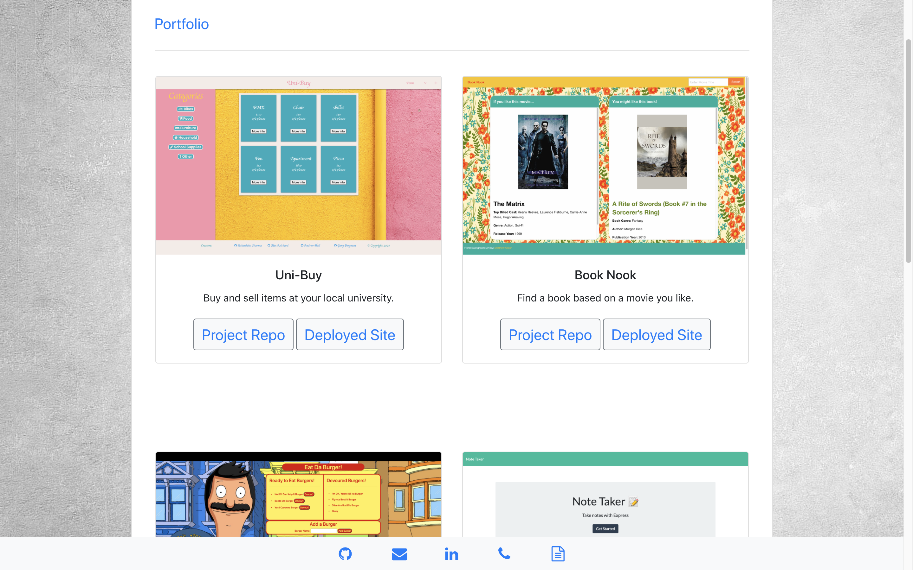
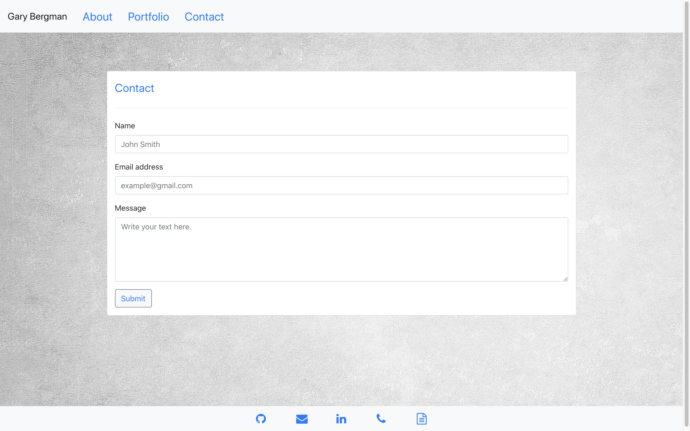
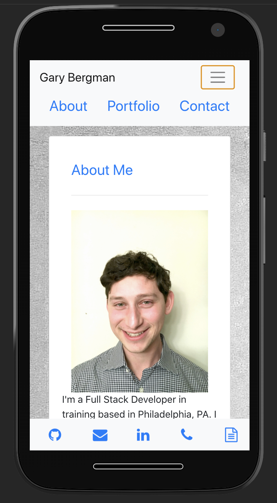

# React Portfolio
  

  ## Deployed

  [Deployed Link](https://react-portfolio-great.herokuapp.com/)

  [MP4 Demo](https://drive.google.com/file/d/1efMIYJ3quPszKAhT5mNj_cpOWswVkKk3/view?usp=sharing)

  [React Portfolio gif](https://drive.google.com/file/d/1qWvg7kvDxC-39AnzWETjzqgiwrIKJFta/view?usp=sharing)

  

  

  

  

    
  

  
  ## Description

  This is my portfolio built with React! Check out the `About Me` page for my bio, the `Contact` page to send me a message, or the `Portfolio` page to see my work!  

  ## Table of Contents

  *  [Deployed](#Deployed)

  *  [Description](#Description)

  *  [Installation](#Installation)

  *  [Usage](#Usage)
  
  *  [License](#License)

  *  [Contributing](#Contributing)

  *  [Tests](#Tests)

  *  [Questions](#Questions)
  

  ## Installation

  To install necessary dependencies, run the following command:

 
    npm i

  ## Usage

  Follow the link above in [Deployed](#Deployed) to run the application from the Heroku server or run the application using the command `node server.js` or `npm start` or `nodemon` in the CLI. Then go to a browser window and enter `localhost:3000/` to view the home page. 

  ## License
  
  This project did not use a license.

  ## Contributing

  To contribute to this project, please send me a message. My github and email are located below in the [Questions](#Questions) section.

  ## Tests

  This project does not currently contain any tests.

  ## Questions

  If you have any questions about this repo, open an issue or contact me directly at [garybergman00@gmail.com](mailto:garybergman00). You can find more of my work at [Gary-Bergman](https://github.com/Gary-Bergman).
  